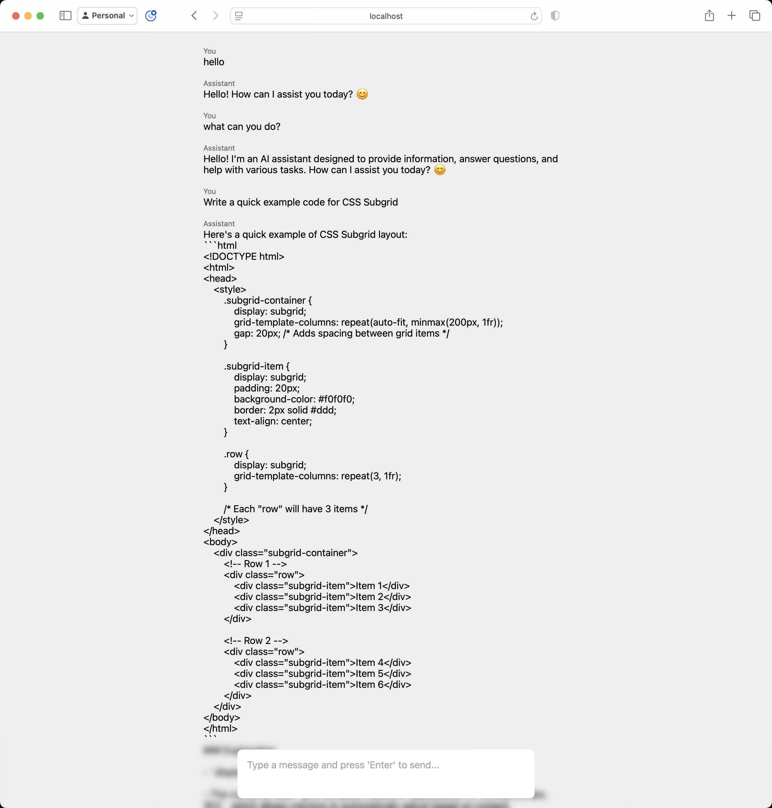

# llm-web-gui
A web GUI for interacting with locally-run LLMs, (DeekSeek for example)

## Instructions

0. This requires you have Ollama installed with a LLM model locally installed. Please do that first
1. Clone this repository
2. Navigate to Root directory
3. Add .env with the entry `MODEL='<model name here>'`
4. Run `npm install`
5. Run `node app.js`
6. On a web browser, navigate to `https://localhost:3000`

## Other Tidbits

- This project saves messages in SessionStorage. Closing the tab will delete your chats
- I don't intend to do much more with this, may prettify it more, but I just wanted to try this
